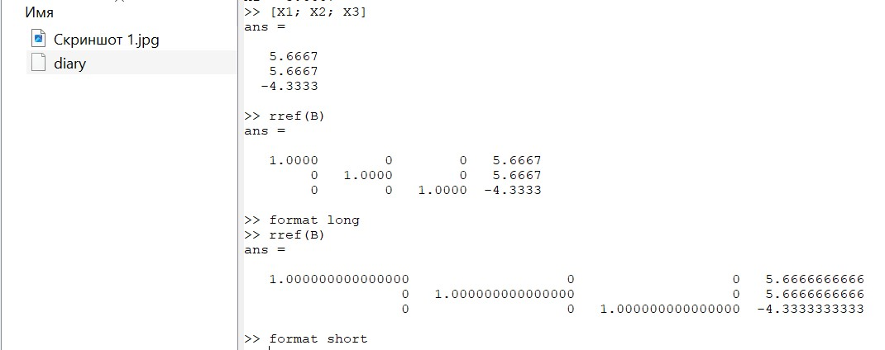
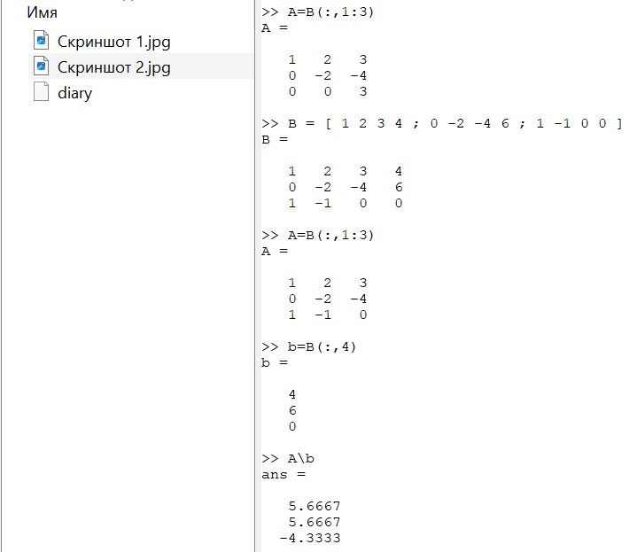
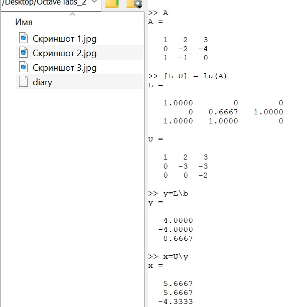
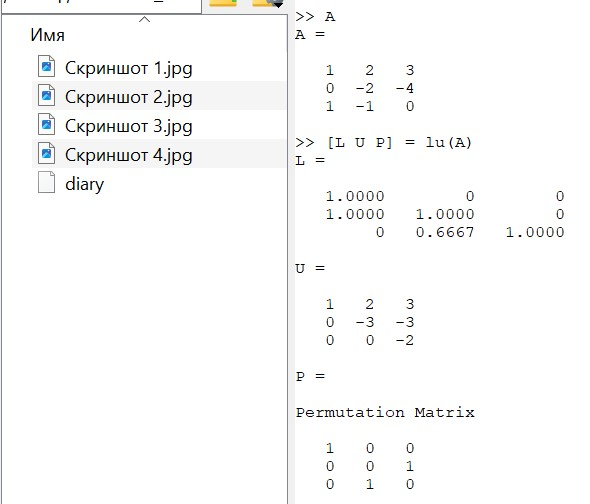

---
## Front matter
lang: ru-RU
title: Лабораторная работа №4
subtitle: Научное программирование
author:
  - Таубер Кирилл Олегович
institute:
  - Российский университет дружбы народов
  - Москва, Россия
date: 3 февраля 2024

## i18n babel
babel-lang: russian
babel-otherlangs: english

## Formatting
mainfont: PT Serif
romanfont: PT Serif
sansfont: PT Sans
monofont: PT Mono
toc: false
slide_level: 2
theme: metropolis
header-includes: 
 - \metroset{progressbar=frametitle,sectionpage=progressbar,numbering=fraction}
 - '\makeatletter'
 - '\beamer@ignorenonframefalse'
 - '\makeatother'
aspectratio: 43
section-titles: true
---

## Цель лабораторной работы

Изучить встроенные в Octave алгоритмы, необходимые для решения систем линейных уравнений.

## Теоретическое введение

Запишем исходную систему

\begin{equation}
 \begin{cases}
   a_{1}^{1}x^{1}+...+ a_{n}^{1}x^{n} = b^{1} \\
   ...\\
   a_{1}^{m}x^{1}+...+ a_{n}^{m}x^{n} = b^{m}
 \end{cases}
\end{equation}

в матричном виде: $Ax=b$. Матрица A называется основной матрицей системы, b — столбцом свободных членов.

Алгоритм решения СЛАУ __методом Гаусса__ подразделяется на два этапа: 

* прямой ход: приводим к треугольной матрице;
* обратный ход: выражаем базисные переменные через небазисные.

## Теоретическое введение

__LU-разложение__ матрицы A имеет вид $A = LU$. Если известно LU-разложение матрицы A, то исходная система может быть записана как $LUx=b$. Эта система может быть решена в два шага: $Ly=b$ и $Ux=y$.

__LUP-разложение__ матрицы A имеет вид $PA=LU$.

## Ход выполнения лабораторной работы
- Для системы линейных уравнений строим расширенную матрицу и реализуем явно метод Гаусса. Для решение треугольной матрицы можно получить вручную

{ #fig:001 width=44% }

## Ход выполнения лабораторной работы
- А можно воспользоваться встроенной командой. Кроме этого, есть возможность поменять формат вывода значений в виде десятичных дробей

{ #fig:002 width=80% }

## Ход выполнения лабораторной работы
- Выделим из расширенной матрицы B матрицу A и вектор b. После чего найдем вектор $x$ из уравнения $Ax=b$ с помощью левого деления

{ #fig:003 width=45% }

## Ход выполнения лабораторной работы
- Реализуем LU-разложение матрицы и найдем вектор $x$

{ #fig:004 width=40% }

## Ход выполнения лабораторной работы
- Реализуем LUP-разложение матрицы

{ #fig:005 width=50% }

## Вывод
- В ходе выполнения данной лабораторной работы я изучил встроенные в Octave алгоритмы, необходимые для решения систем линейных уравнений.
