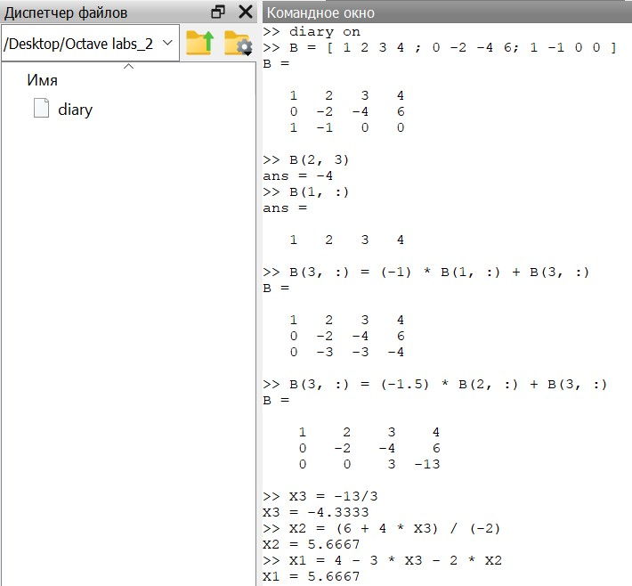
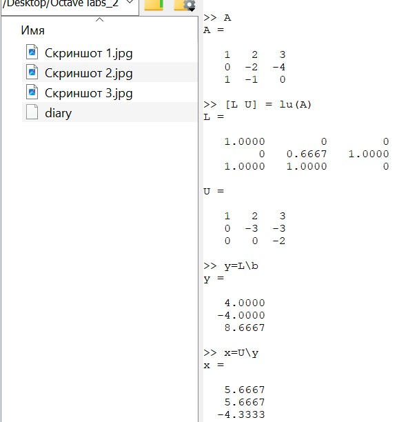

---
## Front matter
title: "Лабораторная работа №4"
subtitle: "Научное программирование"
author: "Таубер Кирилл Олегович"

## Generic otions
lang: ru-RU
toc-title: "Содержание"

## Bibliography
bibliography: bib/cite.bib
csl: pandoc/csl/gost-r-7-0-5-2008-numeric.csl

## Pdf output format
toc: true # Table of contents
toc-depth: 2
lof: true # List of figures
fontsize: 12pt
linestretch: 1.5
papersize: a4
documentclass: scrreprt
## I18n polyglossia
polyglossia-lang:
  name: russian
  options:
	- spelling=modern
	- babelshorthands=true
polyglossia-otherlangs:
  name: english
## I18n babel
babel-lang: russian
babel-otherlangs: english
## Fonts
mainfont: PT Serif
romanfont: PT Serif
sansfont: PT Sans
monofont: PT Mono
mainfontoptions: Ligatures=TeX
romanfontoptions: Ligatures=TeX
sansfontoptions: Ligatures=TeX,Scale=MatchLowercase
monofontoptions: Scale=MatchLowercase,Scale=0.9
## Biblatex
biblatex: true
biblio-style: "gost-numeric"
biblatexoptions:
  - parentracker=true
  - backend=biber
  - hyperref=auto
  - language=auto
  - autolang=other*
  - citestyle=gost-numeric
## Pandoc-crossref LaTeX customization
figureTitle: "Рис."
tableTitle: "Таблица"
listingTitle: "Листинг"
lofTitle: "Список иллюстраций"
lolTitle: "Листинги"
## Misc options
indent: true
header-includes:
  - \usepackage{indentfirst}
  - \usepackage{float} # keep figures where there are in the text
  - \floatplacement{figure}{H} # keep figures where there are in the text
---

# Цель работы

Изучить встроенные в Octave алгоритмы, необходимые для решения систем линейных уравнений.

# Теоретическое введение

__Метод Гаусса__

Запишем исходную систему

\begin{equation*}
 \begin{cases}
   a_{1}^{1}x^{1}+...+ a_{n}^{1}x^{n} = b^{1} \\
   ... \\
   a_{1}^{m}x^{1}+...+ a_{n}^{m}x^{n} = b^{m}
 \end{cases}
\end{equation*}

в матричном виде: $Ax=b$. Матрица A называется основной матрицей системы, b — столбцом свободных членов. Алгоритм решения СЛАУ методом Гаусса подразделяется на два этапа:

* на первом этапе осуществляется так называемый прямой ход, когда путём элементарных преобразований над строками систему приводят к ступенчатой или треугольной форме, либо устанавливают, что система несовместна;

* на втором этапе осуществляется так называемый обратный ход, суть которого заключается в том, чтобы выразить все получившиеся базисные переменные через небазисные и построить фундаментальную систему решений, либо, если все переменные являются базисными, то выразить в численном виде единственное решение системы линейных уравнений.

Для приведения матрицы к треугольному виду для системы уравнений $Ax=b$ используют расширенную матрицу.

__LU-разложение__

LU-разложение — это вид факторизации матриц для метода Гаусса. Цель состоит в том,
чтобы записать матрицу A в виде $A = LU$, где L — нижняя треугольная матрица, а U — верхняя треугольная матрица. Эта факторизованная форма может быть использована для решения уравнения $Ax=b$.

Если известно LU-разложение матрицы A, то исходная система может быть записана как $LUx=b$. Эта система может быть решена в два шага. На первом шаге решается система $Ly=b$. Поскольку L — нижняя треугольная матрица, эта система решается непосредственно прямой подстановкой. На втором шаге решается система $Ux=y$. Поскольку U — верхняя треугольная матрица, эта система решается непосредственно обратной подстановкой.

__LUP-разложение__

Если используются чередования строк, то матрица A умножается на матрицу переста-
новок, и разложение принимает форму $PA=LU$.

Более подробно см. в [@Gauss:bash] и [@LU:bash].

# Выполнение лабораторной работы

Для системы линейных уравнений:

$Ax = b \rightarrow
\begin{bmatrix}
1& 2& 3\\
0& -2& -4\\
1& -1& 0
\end{bmatrix}
\begin{bmatrix}
x^1\\
x^2\\
x^3
\end{bmatrix}
=
\begin{bmatrix}
4\\
6\\
0
\end{bmatrix}$

построим расширенную матрицу вида

$B = [A|b]=
\left[
\begin{array}{ccc|c}
1& 2& 3 & 4\\
0& -2& -4 & 6\\
1& -1& 0 & 0 \\
\end{array}
\right]$.

Рассмотрим ее поэлементно, например, выведем элемент, стоящий на пересечении 2й строки и 3го столбца. Также можем извлечь целый вектор строки или вектор столбца, например, выведем первую строку.

Реализуем явно метод Гаусса. Сначала добавим к третьей строке первую строку, умноженную на −1. Далее добавим к третьей строке вторую строку, умноженную на −1.5. Выведем явно решение системы, а затем воспользуемся встроенной командой. Можем поменять формат вывода значений, чтобы отображалось более пяти десятичных знаков. Затем вернем изначальный формат представления (рис. @fig:001) и (рис. @fig:002). 

{#fig:001 width=90%}

{#fig:002 width=90%}

Встроенная операция для решения линейных систем вида $Ax=b$ в Octave называется левым делением и записывается как $A \backslash b$. Это концептуально эквивалентно выражению $A^{-1}b$. Выделим из расширенной матрицы B матрицу A и вектор $b$. После чего найдем вектор $x$  (рис. @fig:003).

{#fig:003 width=90%}

Пусть дана матрица:

$A = 
\begin{bmatrix}
1& 2& 3\\
0& -2& -4\\
1& -1& 0
\end{bmatrix}$

С помощью Octave распишем её LU-разложение и найдем вектор $x$ (рис. @fig:004).

{#fig:004 width=90%}

Для этой же матрицы A распишем LUP-разложение (рис. @fig:005).

{#fig:005 width=90%}

# Вывод

В ходе выполнения данной лабораторной работы я изучил встроенные в Octave алгоритмы, необходимые для решения систем линейных уравнений.